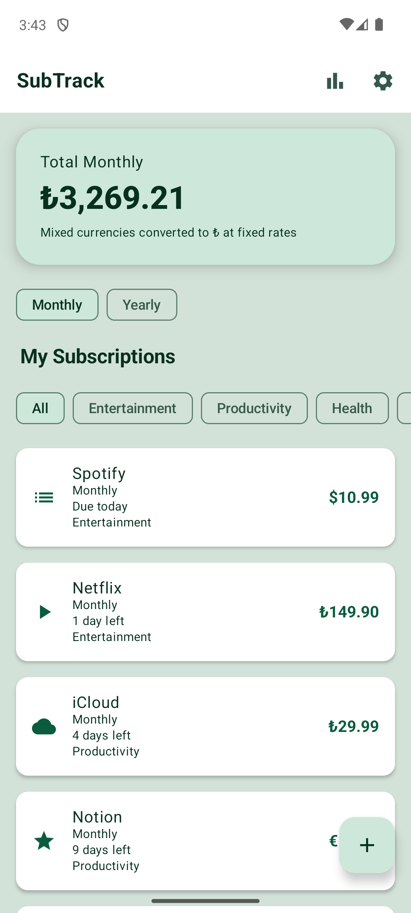
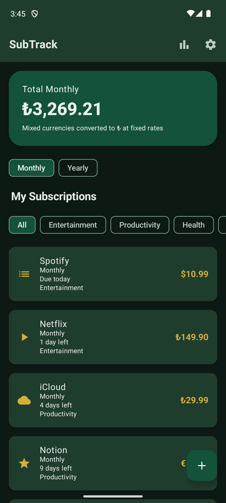
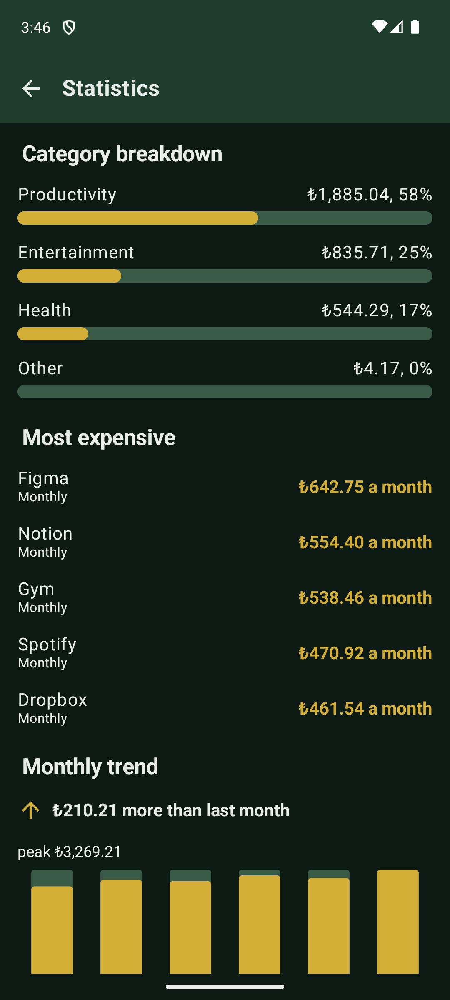
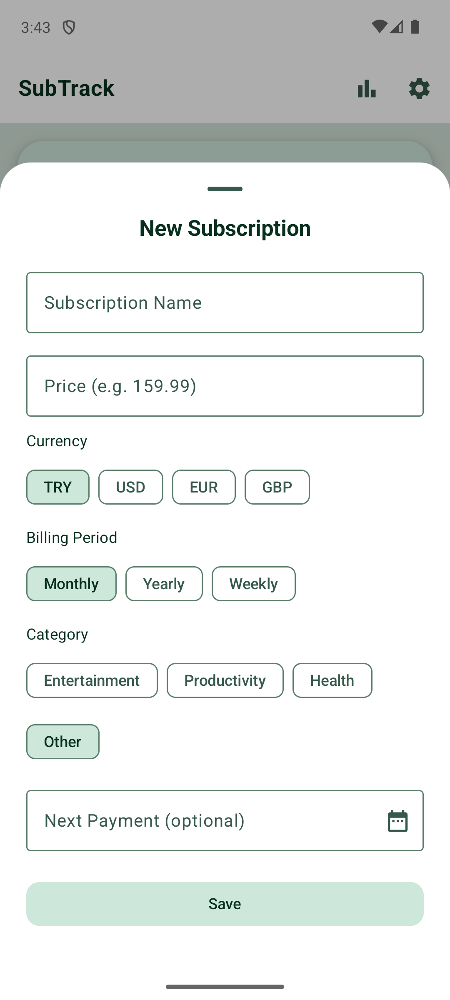

# SubTrack

An Android subscription tracker. Add your recurring payments, see what they actually cost you each month across currencies, and get reminded before the next one is charged.

Built solo in Kotlin and Jetpack Compose. No server, no account, no ads — everything stays on the device.

<p>
  
  
  
  
</p>

## What it does

- Track subscriptions with amount, currency, category and billing period (weekly, monthly, yearly)
- See one monthly total, normalised across currencies and billing periods
- Countdown to the next payment; the stored date is an anchor and is never rewritten
- A daily background check that sends one summary notification for payments due today or tomorrow
- Category distribution, a monthly trend chart and a month-over-month comparison
- Light, dark and system themes, plus optional Material You dynamic colour
- Turkish and English

## Architecture

Three layers, one direction of dependency:

```
ui/       Compose screens, ViewModels, a single UiState per screen
domain/   Pure Kotlin. No android or androidx imports. Models, repository
          interfaces, use cases as pure functions
data/     Room, DataStore, mappers, repository implementations
di/       Hilt modules
reminder/ WorkManager worker, notification channel and scheduling
```

State flows one way: `UiState` down, `onEvent` up. Every screen exposes exactly one state object and one event entry point. ViewModels hold a private `MutableStateFlow` and expose it as read-only; composables perform no calculation.

Money is stored as `Long` cents throughout. `Double` and `Float` are forbidden anywhere near a monetary value.

## Some decisions worth reading

The full reasoning for every architectural decision lives in [`docs/ARCHITECTURE.md`](docs/ARCHITECTURE.md). Four examples:

**Rounding happens exactly once.** Converting a weekly ₺10 subscription into a monthly figure in USD involves a period normalisation and a currency conversion. Rounding each step separately accumulates error, so both run on a scaled intermediate and only the final result is rounded. A test proves the difference by computing the same total both ways.

**The intermediate had a ceiling, so it was measured.** Weekly normalisation multiplies by 52, which cut the number of rows that fit in a `Long` intermediate from 9,223 to 177. Neither the price cap nor the exchange-rate cap was lowered; the intermediate moved to `BigInteger` instead. Headroom went to roughly 21 million rows, and two tests pin the numbers.

**A countdown is not a property of a subscription.** "4 days left" is a property of a subscription *and today*, so it lives in `HomeUiState`, not in the domain model. The calculation is a pure function taking today as a parameter, with `Clock` injected through Hilt so tests run at fixed dates.

**Auto Backup was already on, and silently wrong.** The manifest pointed at Android Studio's template backup rules, whose empty rule sets mean "take everything". Measurement showed 85 KB leaving the sandbox with no configuration written. It also showed why naming a single file would have failed: the database file held 4 KB while its write-ahead log held 103 KB.

## Testing

| | |
|---|---|
| Unit tests | 330 |
| Instrumentation tests | 19 |
| Manual regression checklist | 117 items |
| Devices in the matrix | API 24, 29, 34, 36 |

Unit tests are written against the public surface of a ViewModel, never against private internals, and use hand-written fakes rather than a mocking library. Tests that collect a `stateIn` flow must open a collector — without one they pass while verifying nothing, which is worse than failing.

The regression checklist in [`docs/TESTING.md`](docs/TESTING.md) is run on each emulator before a phase closes, with evidence recorded at coordinate level rather than as pass/fail. It also records the measurement traps found along the way: swipes starting too near the right edge trigger the system back gesture on API 34+, `uiautomator dump` can return a stale tree right after an install, and `advanceUntilIdle()` no longer drives `backgroundScope`.

## Built with

Kotlin 2.2.10 · Jetpack Compose (Material 3) · Hilt 2.60.1 · Room 2.8.4 · DataStore 1.1.7 · WorkManager 2.11.2 · Navigation Compose 2.9.5 · KSP · coroutines and Flow · core library desugaring for `java.time`

`minSdk` 24, `targetSdk` 36, AGP 9.0.1. Release builds run R8 with resource shrinking; the release APK is 2.03 MiB.

## Build

```
git clone https://github.com/Elina-cn/SubTrack.git
cd SubTrack
./gradlew :app:assembleDebug
```

Release builds need signing values in `local.properties`; without them the release build still completes and produces an unsigned APK.

## Project documents

Development ran in numbered phases, each one closed with a tag. The working documents are kept in the repository:

- [`docs/ARCHITECTURE.md`](docs/ARCHITECTURE.md) — architectural decisions and their reasoning
- [`docs/ROADMAP.md`](docs/ROADMAP.md) — phases and their completion criteria
- [`docs/TESTING.md`](docs/TESTING.md) — the regression checklist and emulator notes
- [`docs/PROGRESS.md`](docs/PROGRESS.md) — what happened in each phase

## Licence

Not yet decided.
